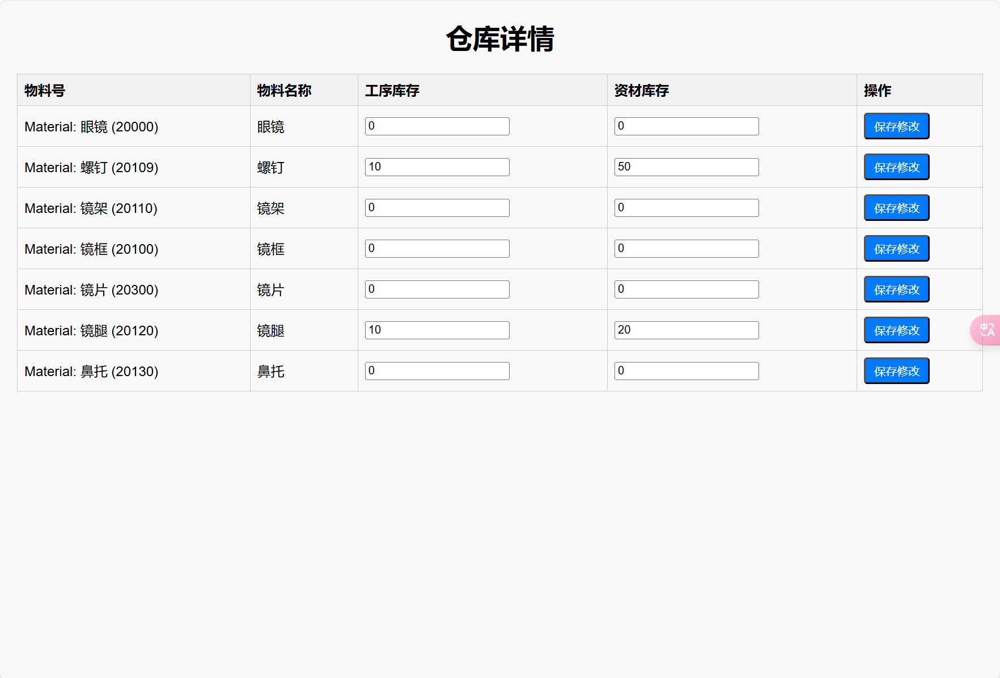

# ECUST电商金融MPR计算

## 目录

- [项目功能](#项目功能)
- [安装指南](#安装指南)
- [演示截图](#演示截图)
- [贡献者](#贡献者)

## 项目功能

- mps记录添加
- 查询mps计算结果且支持多条mps同时查询
- 总览mps记录并可以进行删除
- 查看仓库并对仓库量进行修改
- 查看资产负债表并计算变量公式

## 安装指南

### 先决条件

- 我使用的软件版本：Python 3.12、PyCharm专业版 

### 安装步骤

1. 克隆仓库：
   ```bash
   git clone https://github.com/violetfengye/MRP.git
   ```
2. 安装依赖：
   
   ```bash
   pip install -r requirements.txt
   ```
3. 运行项目：
   ```bash
   python manage.py runserver
   ```

## 演示截图

1. 主界面：

2. 添加mps界面：

3. mps添加成功界面：

4. 查看mps记录界面

5. 查询mrp计算结果界面：


6. 查看仓库界面：

7. 查看资产负债表界面：


## 贡献者

**最大贡献者：ChatGPT（🐕头）**